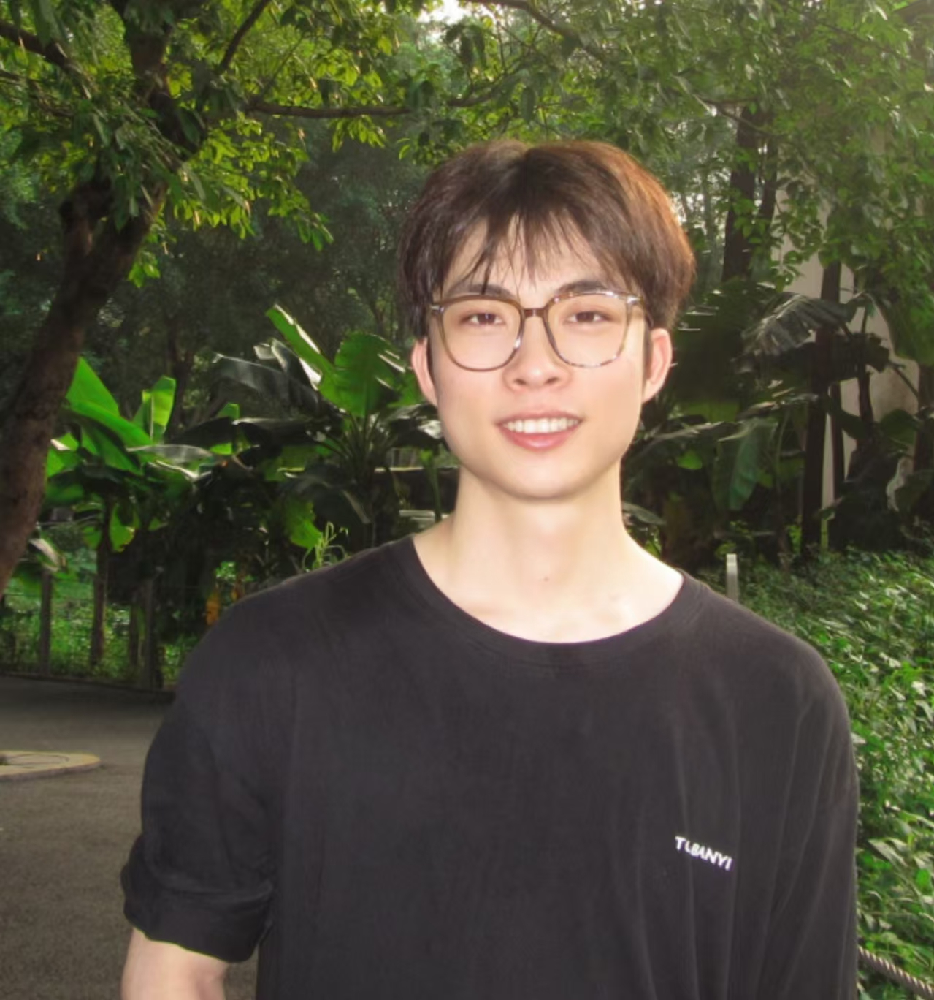

<h1 align='center'>
   
  
   
</h1>

Shaoshen Chen 陈少深  
[Google Scholar](https://scholar.google.com/citations?hl=zh-CN&user=cqvOrw0AAAAJ) / [Github](https://github.com/chenchenchen77)

Hi! I am a Master's student at [Tsinghua University](https://www.tsinghua.edu.cn/en/) (2024–2027), advised by Prof. [Haitao Zheng](https://scholar.google.com/citations?user=7VPeORoAAAAJ&hl=zh-CN). I am currently interning at the multimodal pretraining team at [Zhipu](https://github.com/zai-org), supervised by [Weihan Wang](https://scholar.google.com/citations?user=UaxGkIwAAAAJ&hl=zh-CN).

[**I will graduate in 2027 and am actively seeking opportunities.**](https://github.com/chenchenchen77)✨

My research interests mainly lie in:

* __Long-Context LLMs__: Building structured representations and compression methods for efficient long-context inference.
* __Multimodal Pretraining__: Building and scaling vision-language foundation models for diverse downstream tasks.

## Publications

\* denotes equal contribution.

* [NeurIPS 2025] __AdmTree: Compressing Lengthy Context with Adaptive Semantic Trees__. [[paper](https://openreview.net/pdf?id=l3Qq5MU5VX)]
    * Yangning Li\*, __Shaoshen Chen__\*, Yinghui Li, Yankai Chen, Hai-Tao Zheng, Hui Wang, Wenhao Jiang, Philip S. Yu
     

* [ACL Findings 2025] __DAST: Context-aware Compression in LLMs via Dynamic Allocation of Soft Tokens__. [[paper](https://aclanthology.org/2025.findings-acl.1055.pdf)] [[code](https://github.com/chenchenchen77)]
    * __Shaoshen Chen__\*, Yangning Li\*, Zishan Xu, Yongqin Zeng, Shunlong Wu, Xinshuo Hu, Zifei Shan, Xin Su, Jiwei Tang, Yinghui Li, Hai-Tao Zheng
     

* [ACL 2024] __Towards Real-World Writing Assistance: A Chinese Character Checking Benchmark with Faked and Misspelled Characters__. [[paper](https://aclanthology.org/2024.acl-long.469.pdf)] [[code](https://github.com/THUKElab/Visual-C3)]
    * Yinghui Li\*, Zishan Xu\*, __Shaoshen Chen__\*, Haojing Huang, Yangning Li, Shirong Ma, Yong Jiang, Zhongli Li, Qingyu Zhou, Hai-Tao Zheng, Ying Shen
     

* [ESWA 2024] __Correct Like Humans: Progressive Learning Framework for Chinese Text Error Correction__. [[paper](https://arxiv.org/pdf/2306.17447)]
    * Yinghui Li\*, Shirong Ma\*, __Shaoshen Chen__\*, Haojing Huang, Shulin Huang, Yangning Li, Hai-Tao Zheng, Ying Shen
     

* [SPL 2024] __Robust Multi-Prototypes Aware Integration for Zero-Shot Cross-Domain Slot Filling__. [[paper](https://ieeexplore.ieee.org/document/10749999)]
    * __Shaoshen Chen__, Peijie Huang, Zhanbiao Zhu, Yexing Zhang, Yuhong Xu
     

* [TASLP 2024] __ELSF: Entity-Level Slot Filling Framework for Joint Multiple Intent Detection and Slot Filling__. [[paper](https://ieeexplore.ieee.org/abstract/document/10747289)]
    * Zhanbiao Zhu, Peijie Huang, Haojing Huang, Yuhong Xu, Piyuan Lin, Leyi Lao, __Shaoshen Chen__, Haojie Xie, Shangjian Yin
     

## 🏆 Awards
* 2025 First-class Scholarship, Shenzhen International Graduate School, Tsinghua University
* 2023 National Scholarship in China
* 2022 First-class Scholarship, South China Agricultural University

## 📖 Educations
* 2024.09 - Present, Tsinghua University, M.S. in Computer Science
* 2020.09 - 2024.06, South China Agricultural University, B.E. in Computer Science
